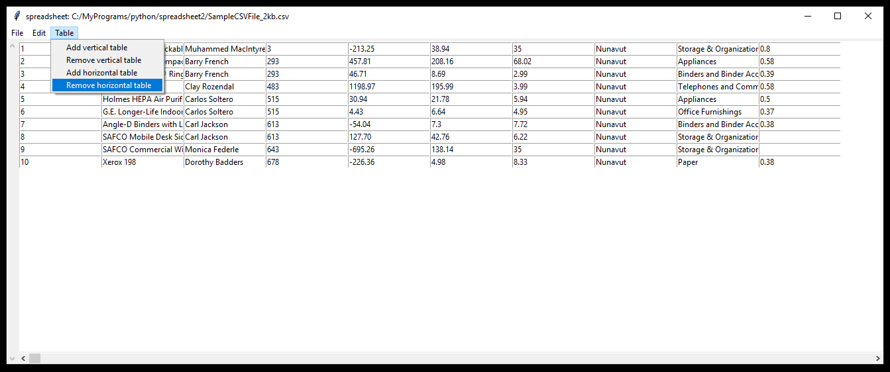

# simple-spreadsheet-made-with-python
A simple spreadsheet program made with python

Written by philip0000000  
Find the project here [https://github.com/philip0000000/simple-spreadsheet-made-with-python]  
Program has been successfully tested on Windows 10 and Ubuntu 22.04 LTS with Python 3.10.

## Information

The program can open and save comma-separated values(CSV) files.  
Sample .csv files can be found here: https://sample-videos.com/download-sample-csv.php

## License

Licensed under the MIT license.

